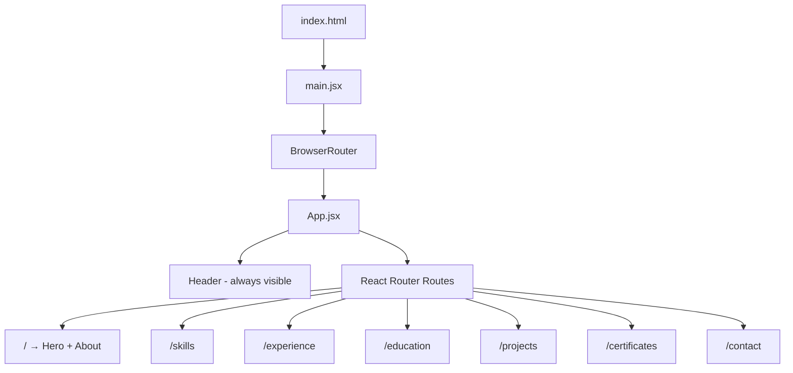
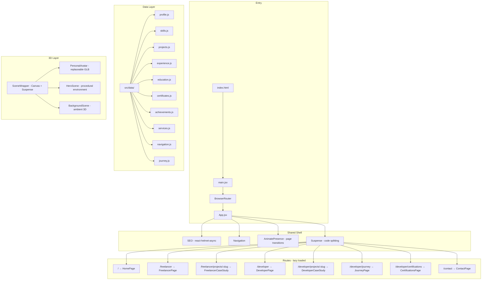
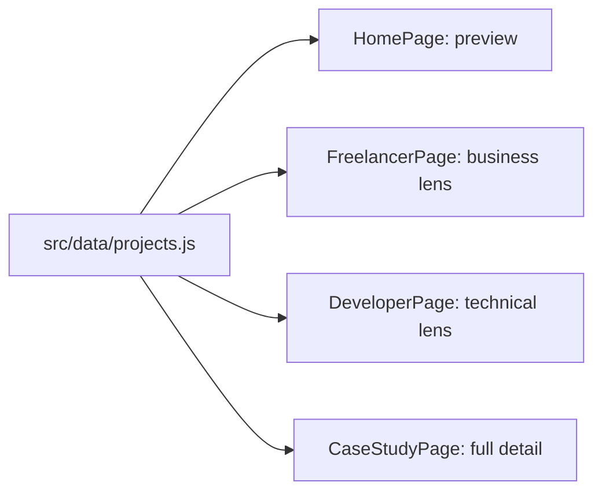
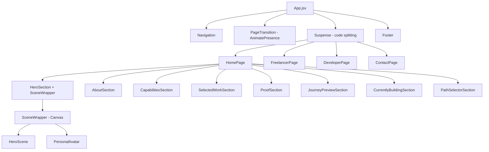

# Architecture

> Version: 1.0  
> Last Updated: 2026-10-01  
> Status: Approved — Implementation Phase Pending

---

## Existing Architecture (Pre-Transformation)



**Problems**: No data layer, hardcoded content in JSX, resolution hacks, no code splitting, no SEO management, no 3D, duplicate assets, exposed API key.

---

## Target Architecture



---

## Folder Structure (Target)

```
portfolio/
├── AGENTS.md                           # Operating contract
├── docs/                               # Project documentation
│   ├── PRODUCT_SPEC.md
│   ├── ARCHITECTURE.md
│   ├── DESIGN_SYSTEM.md
│   ├── IMPLEMENTATION_PLAN.md
│   ├── DECISIONS.md
│   ├── PROGRESS.md
│   ├── CONTENT_SCHEMA.md
│   └── 3D_STRATEGY.md
├── public/
│   ├── certificates/                   # Certificate PDFs & optimized images
│   ├── models/                         # Future GLB/GLTF assets
│   ├── hero.jpg                        # Profile photo
│   ├── resume.pdf                      # Resume
│   ├── favicon.ico                     # Cleaned favicon
│   ├── og-image.jpg                    # Social preview image
│   ├── sitemap.xml                     # SEO
│   └── robots.txt                      # SEO
├── .env                                # API keys (gitignored)
├── .env.example                        # Template for env vars
├── src/
│   ├── main.jsx                        # Entry point
│   ├── App.jsx                         # Root: routing + shell
│   ├── data/                           # Single source of truth
│   │   ├── profile.js
│   │   ├── skills.js
│   │   ├── projects.js
│   │   ├── experience.js
│   │   ├── education.js
│   │   ├── certificates.js
│   │   ├── achievements.js
│   │   ├── services.js
│   │   ├── navigation.js
│   │   └── journey.js
│   ├── components/
│   │   ├── layout/                     # Shell components
│   │   │   ├── Navigation.jsx
│   │   │   ├── Footer.jsx
│   │   │   ├── PageTransition.jsx
│   │   │   └── SEOHead.jsx
│   │   ├── ui/                         # shadcn/ui + custom primitives
│   │   │   ├── badge.jsx
│   │   │   ├── button.jsx
│   │   │   ├── card.jsx
│   │   │   ├── tooltip.jsx
│   │   │   └── ...
│   │   ├── shared/                     # Shared section components
│   │   │   ├── ProjectCard.jsx
│   │   │   ├── CertificateCard.jsx
│   │   │   ├── TimelineMilestone.jsx
│   │   │   ├── PathSelector.jsx
│   │   │   └── SectionHeading.jsx
│   │   └── three/                      # 3D components
│   │       ├── SceneWrapper.jsx
│   │       ├── PersonalAvatar.jsx
│   │       ├── HeroScene.jsx
│   │       ├── AmbientScene.jsx
│   │       └── WebGLFallback.jsx
│   ├── pages/
│   │   ├── HomePage/
│   │   │   ├── index.jsx
│   │   │   ├── HeroSection.jsx
│   │   │   ├── AboutSection.jsx
│   │   │   ├── CapabilitiesSection.jsx
│   │   │   ├── SelectedWorkSection.jsx
│   │   │   ├── ProofSection.jsx
│   │   │   ├── JourneyPreviewSection.jsx
│   │   │   ├── CurrentlyBuildingSection.jsx
│   │   │   └── PathSelectorSection.jsx
│   │   ├── FreelancerPage/
│   │   │   ├── index.jsx
│   │   │   ├── FreelancerHero.jsx
│   │   │   ├── ServicesSection.jsx
│   │   │   ├── ClientProblemsSection.jsx
│   │   │   ├── FreelanceWorkSection.jsx
│   │   │   ├── ProcessSection.jsx
│   │   │   ├── WhyWorkWithMeSection.jsx
│   │   │   ├── FAQSection.jsx
│   │   │   └── ProjectInquirySection.jsx
│   │   ├── DeveloperPage/
│   │   │   ├── index.jsx
│   │   │   ├── DeveloperHero.jsx
│   │   │   ├── EngineeringProfileSection.jsx
│   │   │   ├── TechStackSection.jsx
│   │   │   ├── ProjectsSection.jsx
│   │   │   ├── ArchitectureSection.jsx
│   │   │   ├── HowIThinkSection.jsx
│   │   │   ├── JourneySection.jsx
│   │   │   ├── EducationSection.jsx
│   │   │   ├── ExperienceSection.jsx
│   │   │   ├── CertificationsPreview.jsx
│   │   │   ├── AchievementsSection.jsx
│   │   │   └── ResumeSection.jsx
│   │   ├── CaseStudyPage/
│   │   │   └── index.jsx              # Shared, renders per path context
│   │   ├── JourneyPage/
│   │   │   └── index.jsx              # Full interactive timeline
│   │   ├── CertificationsPage/
│   │   │   └── index.jsx
│   │   └── ContactPage/
│   │       └── index.jsx
│   ├── hooks/
│   │   ├── useWebGLSupport.js
│   │   ├── useReducedMotion.js
│   │   ├── useScrollProgress.js
│   │   └── useDeviceCapability.js
│   ├── lib/
│   │   └── utils.js                    # cn() utility (preserved)
│   └── assets/
│       └── css/
│           ├── index.css               # Global styles + design tokens
│           └── prism.css               # Code highlighting (if retained)
├── components.json                     # shadcn/ui config
├── tailwind.config.js
├── postcss.config.js
├── vite.config.js
├── eslint.config.js
├── jsconfig.json
├── vercel.json
└── package.json
```

---

## Routing

```
/                                   → HomePage (universal overview)
/freelancer                         → FreelancerPage (client experience)
/freelancer/projects/:slug          → CaseStudyPage (business-oriented)
/developer                          → DeveloperPage (engineering experience)
/developer/projects/:slug           → CaseStudyPage (technical-oriented)
/developer/journey                  → JourneyPage (interactive timeline)
/developer/certifications           → CertificationsPage (full collection)
/contact                            → ContactPage (shared)
```

All routes are deep-linkable and shareable. Browser back/forward works naturally.

---

## Shared Data Layer

All portfolio content is centralized in `src/data/`. Components import data — they never define it inline.

See [CONTENT_SCHEMA.md](./CONTENT_SCHEMA.md) for field definitions.



---

## Component Hierarchy



---

## 3D Architecture

See [3D_STRATEGY.md](./3D_STRATEGY.md) for full detail.

Summary:

- `SceneWrapper` owns the R3F `<Canvas>`, `<Suspense>`, error boundary, and WebGL detection
- `PersonalAvatar` is an isolated component accepting a model path prop
- `HeroScene` contains the procedural environment
- All 3D is lazy-loaded and never blocks initial UI render

---

## Animation Architecture

| Layer | System | Scope |
|---|---|---|
| Page transitions | Framer Motion `AnimatePresence` | Route changes |
| Scroll animations | Framer Motion `useScroll` + `useTransform` | Section reveals |
| Smooth scrolling | Lenis | Global scroll feel |
| 3D animation | React Three Fiber `useFrame` | Scene, camera, objects |
| Micro-interactions | CSS transitions/animations | Hover, focus, press |

---

## State Management

No global state library. Use:

- `useState` / `useReducer` for local component state
- URL params (React Router) for active path/project context
- `useScroll` / `useTransform` for scroll-driven state
- Props for data flow from data layer

---

## Asset Architecture

| Asset | Location | Format | Strategy |
|---|---|---|---|
| Profile photo | `public/hero.jpg` | JPEG (compress to <200KB) | Eager load on hero |
| Certificate images | `public/certificates/` | WebP (converted from PNG) | Lazy load |
| Certificate PDFs | `public/certificates/` | PDF | On-demand download |
| Resume | `public/resume.pdf` | PDF | On-demand download |
| 3D models (future) | `public/models/` | GLB/GLTF | Lazy load |
| Favicon | `public/favicon.ico` | ICO | Single reference |
| OG image | `public/og-image.jpg` | JPEG | Social preview |

**Delete**: duplicate images in `src/assets/images/certificates/`, duplicate `src/assets/images/hero.jpg`, orphaned `olova*.png`

---

## Form Architecture

- Backend: Web3Forms API (retained)
- API key: `VITE_WEB3FORMS_KEY` environment variable
- States: idle → validating → submitting → success | error
- Retry: manual retry button on error
- Accessibility: proper labels, error messages, ARIA live regions

---

## SEO Architecture

- `react-helmet-async` for per-route meta management
- `<SEOHead>` component with props for title, description, canonical, OG tags
- Static `sitemap.xml` and `robots.txt` in `public/`
- JSON-LD Person schema on homepage
- Unique meta per route

---

## Error Handling

- React Error Boundary wrapping 3D scenes (fallback to 2D)
- 404 catch-all route with navigation back
- Form error states with user feedback
- Image `onError` fallbacks

---

## Responsive Architecture

| Breakpoint | Target |
|---|---|
| `<640px` | Mobile |
| `640-768px` | Large mobile |
| `768-1024px` | Tablet |
| `1024-1280px` | Desktop |
| `>1280px` | Large desktop |

CSS breakpoints only. No JavaScript viewport sniffing. Container queries where useful.

---

## Performance Architecture

- Route-level code splitting via `React.lazy()` + `Suspense`
- 3D scenes lazy-loaded inside their own `Suspense` boundary
- Images: WebP format, `loading="lazy"`, compressed
- Certificate images: max 200KB each after optimization
- Deferred 3D canvas rendering (UI renders first)
- GPU detection for 3D quality tiering

---

## Deployment Architecture

- Platform: Vercel
- SPA rewrite: `vercel.json` `{ "rewrites": [{ "source": "/(.*)", "destination": "/" }] }`
- Environment variables: Vercel dashboard
- Build: `vite build`
- Preview: `vite preview`

---

## What Is Being Preserved

| Item | Status |
|---|---|
| Vite config + @/ alias | Preserved as-is |
| React 18 + JSX | Preserved |
| React Router v7 | Preserved, routes restructured |
| Tailwind CSS v3 + shadcn tokens | Preserved, extended |
| Framer Motion | Preserved, expanded usage |
| Lenis | Preserved |
| shadcn/ui primitives (badge, button, card, tooltip) | Preserved |
| ESLint 9 config | Preserved |
| Vercel deployment | Preserved |
| Web3Forms integration | Preserved, key moved to env |
| All portfolio content | Preserved, extracted to data layer |
| Profile photo, certificates, resume | Preserved, optimized |
| `cn()` utility | Preserved |

## What Will Be Refactored

| Item | Action |
|---|---|
| All hardcoded content in JSX | Extract to `src/data/` |
| Resolution hacks (1366x768) | Remove, replace with CSS breakpoints |
| Inline `<style>` tags | Move to CSS files or Tailwind config |
| `window.innerWidth` in render | Remove |
| Duplicate assets | Consolidate to `public/` |
| App.jsx routing | Restructure to new route map |
| Navigation | Redesign component |
| Contact form API key | Move to `.env` |

## What Will Be Deleted

| Item | Reason |
|---|---|
| `src/components/enhanced-portfolio-card.jsx` | Unused |
| `src/components/AnimatedGrid.jsx` | Unused |
| `src/components/ui/cool-mode.jsx` | Unused |
| `src/components/ui/evervault-card.jsx` | Unused |
| `src/assets/images/olova*.png` | Orphaned |
| `src/assets/images/hero.jpg` | Duplicate of `public/hero.jpg` |
| `src/assets/images/certificates/` | Duplicate of `public/certificates/` |
| `isOnePage` toggle in App.jsx | No longer needed |
| `public/_redirects` | Replaced by Vercel config |
| `public/vite.svg` | Replaced by proper favicon |
